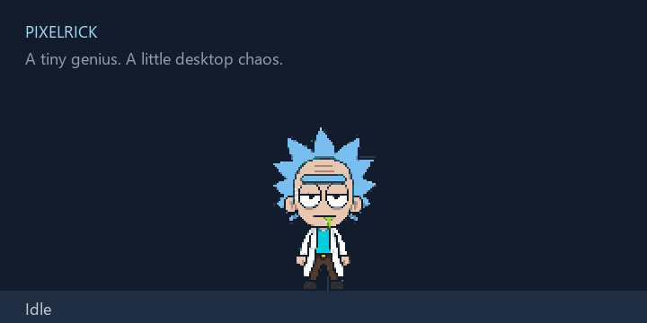

# PixelRick

A tiny pixel scientist for your Windows or Mac desktop. He wanders, naps, gets
annoyed, and makes dramatic exits through a green portal. Entirely offline; no chat,
accounts, telemetry, or Mac App Store required.

| Platform | Compatibility |
| --- | --- |
| Windows 10/11, 64-bit | Supported — accepted v0.1.0 stable release |
| macOS 13+, Apple Silicon | v0.2.0 development preview |
| macOS 13+, Intel | v0.2.0 development preview; native Intel validation |



## Download

**Windows:** [Download PixelRick-Setup.exe](https://github.com/XuJP264/PixelRick/releases/latest/download/PixelRick-Setup.exe)

**macOS — Apple Silicon:** [Download PixelRick-macOS-arm64.dmg](https://github.com/XuJP264/PixelRick/releases/download/v0.2.0-preview.1/PixelRick-macOS-arm64.dmg)

**macOS — Intel:** [Download PixelRick-macOS-x64.dmg](https://github.com/XuJP264/PixelRick/releases/download/v0.2.0-preview.1/PixelRick-macOS-x64.dmg)

No .NET installation or development tools needed. Windows portable ZIPs and the
cross-platform Windows preview are also available from [Releases](https://github.com/XuJP264/PixelRick/releases).

The Mac preview is **not Developer ID signed or notarized**. It is a development
build for review; v0.1.0 remains the latest stable Windows release.

## Features

- Seventeen character animations and eight separate pixel effects, shared by both platforms.
- Gentle wandering, cursor curiosity, naps, and escalating click irritation.
- Pick him up, throw him, or double-click for a portal trip.
- Transparent desktop rendering, crisp pixels, and taskbar/Dock/menu-bar avoidance.
- Tray or Mac menu-bar controls, settings, optional sounds and launch at login.
- Multi-monitor positioning, remembered settings, and one pet per session.
- Shared C# behavior engine; WPF on Windows and open-source Avalonia on macOS.

## Installation

**Windows:** Download **PixelRick-Setup.exe**, double-click, choose **Install**,
and leave **Launch PixelRick** checked. No administrator privileges needed.
For the portable version, extract the ZIP and double-click **PixelRick.exe**.
Windows may show an unsigned publisher/SmartScreen prompt.

**macOS:** Open the DMG, drag **PixelRick.app** to **Applications**, then launch it.
For this unsigned preview, if macOS blocks launch, open **System Settings → Privacy
& Security → Open Anyway** after checking the download source. No terminal needed.
To uninstall, quit from the menu-bar icon and move PixelRick.app to the Trash.

Preferences survive uninstall on both platforms.

## Controls

| Action | Result |
| --- | --- |
| Click | A reaction; repeated clicks build irritation |
| Drag and release | Pick up, drop, or throw |
| Double-click | Portal teleport |
| Right-click Rick | Stay, wander, sleep, wake, teleport, settings, quit |
| Tray / menu-bar icon | Show/hide and quick controls |
| Launch again | Show the existing pet |

Sound and startup are off by default. **Stay** stops walking; portal travel remains
available. Walking stays on the current monitor; dragging and portals can change
monitors. Disable **Use all monitors** to keep Rick on the primary display.

Settings locations:

- Windows: `%APPDATA%\PixelRick\config.json` (unchanged).
- macOS: `~/Library/Application Support/PixelRick/config.json`.

## Screenshots / Demo

The animation above is a deterministic sprite preview on a presentation backdrop.
[All animation frames](ArtReview/all_animations_contact_sheet.png),
[individual animation GIFs](ArtReview), and [live Windows render](ArtReview/app_screenshot.png)
use the same assets as the Mac version.

Mac screenshots, a live-rendered behavior GIF, and machine-readable test reports
are included in **PixelRick-Validation.zip** on the preview release.
See [validation results](VALIDATION.md) and [known limits](KNOWN_ISSUES.md).


[Apple Silicon desktop screenshot](ArtReview/macOS/arm64/hosted-macos-desktop.png) ·
[Intel desktop screenshot](ArtReview/macOS/x64/hosted-macos-desktop.png) ·
[Mac Settings](ArtReview/macOS/arm64/settings.png)

## Building from Source

Build with the **.NET 10 SDK**; applications still target and bundle **.NET 8**.
Install the .NET 8 runtime/SDK too to run framework-dependent tests. Checked-in
assets are ready to use; no art generation service is required.

Windows:

```powershell
dotnet build
dotnet test
dotnet run --project src/PixelRick
dotnet publish src/PixelRick/PixelRick.csproj -c Release -r win-x64 --self-contained true
```

For the Windows installer, install Python 3.14 and Inno Setup 6, then run
`python -m pip install -r tools/art_pipeline/requirements.txt` and `./tools/release.ps1`.

macOS (Xcode command-line tools and Python are needed only for development):

```bash
dotnet build PixelRick.Mac.slnf -c Release
dotnet test tests/PixelRick.Core.Tests -c Release
python3 -m pip install -r tools/art_pipeline/requirements.txt
python3 tools/macos/package.py --arch arm64
python3 tools/macos/validate.py --arch arm64
```

Use `--arch x64` on an Intel Mac. Packaging runs natively on each architecture.
[Architecture and native interop](docs/MACOS.md) ·
[Signing and notarization setup](docs/MACOS_SIGNING.md) ·
[Art pipeline](tools/art_pipeline/README.md).

`version.json` controls application and package versions. A `vX.Y.Z-preview.N`
tag produces a prerelease after Windows and both Mac jobs pass. Stable `vX.Y.Z`
tags additionally require Developer ID signing and notarization. Credentials live
only in GitHub Actions secrets. Linux is outside the current support scope.

## License

Source code and tooling: [MIT](LICENSE). Character art, icons, and visual previews
are excluded from MIT; see [artwork notice](ARTWORK-NOTICE.md).
Unofficial *Rick and Morty* fan project, with no affiliation or endorsement.
